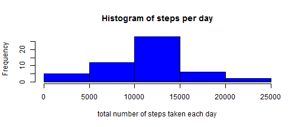
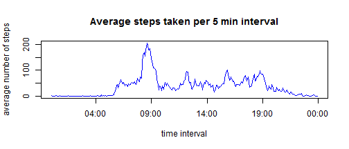
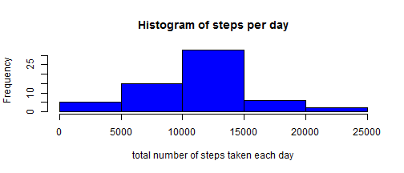
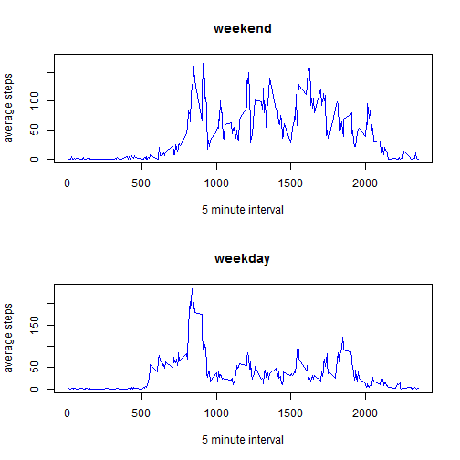

## Data Processing Prerequisites

* The working directory is set to the local clone of the forked http://github.com/rdpeng/RepData_PeerAssessment1 GitHub repository 
* The file activity.zip and this file PA1_template.Rmd are in the working directory
* The current user has sufficient privileges to create files and directories in the working directory
* The required libraries (see below) have been installed

Loading the required libraries

```r
library(dplyr)
```

## Loading and preprocessing the data

Extract the data file activity.csv from the archive file activity.zip in the working directory

```r
if (! file.exists('activity.csv'))
        unzip('activity.zip', 'activity.csv')
```

Read the csv data file. It has a header line and columns steps, date and interval. After reading the data,  
* date is converted from factor to POSIXct,   
* an additional weekday column is derived from date,   
* an additional datetime column is calculated based on date and interval   
* an additional time column is calculated based on the interval only   

Since time cannot be represented Sys.time() is used as an arbitrary date. All values in the time column share this same date and differ only in hours and minutes.

```r
base_date <- trunc(Sys.time(), 'day')

add_interval_function <- function(date_param, interval_param) {
       hours <- (interval_param %/% 100)
       minutes <- interval_param %% 100
       day = trunc(as.POSIXct(date_param), 'day')

       day + (hours * 3600) + (minutes * 60)
}

activity_data <- read.csv(file = "activity.csv", sep = ",", header = TRUE) %>%
        mutate(date = as.Date( date, format = "%Y-%m-%d")) %>%
        mutate(datetime = add_interval_function(date, interval)) %>%
        mutate(time = add_interval_function(base_date, interval)) %>%
        transform(weekday = weekdays(date)) %>%
        select(weekday, datetime, date, time, interval, steps)
```


## What is mean total number of steps taken per day?

Calculate the total number of steps for each day and create a histogram

```r
steps_per_day <- activity_data %>%
        filter(!is.na(steps)) %>%
        group_by(date) %>%
        summarize(steps_sum = sum(steps))

hist(steps_per_day$steps_sum,
     xlab="total number of steps taken each day",
     main="Histogram of steps per day",
     col="blue")
```

 

Calculate the mean and median  total number of steps taken per day


```r
steps_per_day_mean <- mean(steps_per_day$steps_sum)
steps_per_day_median <- median(steps_per_day$steps_sum)
```

Mean total number of steps taken per day: `steps_per_day_mean = 10766.18868`  
Median total number of steps taken per day: `steps_per_day_median = 10765`


## What is the average daily activity pattern?

Get the average numer of steps taken by interval

```r
average_steps_per_interval <- activity_data %>%
        filter(!is.na(steps)) %>%
        group_by(time) %>%
        summarize(steps_mean = mean(steps)) %>%
        arrange(time)

plot(average_steps_per_interval$time, 
        average_steps_per_interval$steps_mean,
        type='l', 
        xlab='time interval', 
        ylab='average number of steps', 
        main='Average steps taken per 5 min interval',
        col='blue')
```

 

Find the interval with the maximum number of steps taken.

```r
max_steps_per_interval <- activity_data %>%
        filter(!is.na(steps)) %>%
        group_by(interval) %>%
        summarize(steps_max = max(steps)) %>%
        arrange(desc(steps_max))

first_row <- max_steps_per_interval[1,]
```

The maximum number of steps per interval was `806` and was observerd in the interval `615`


## Imputing missing values


```r
number_of_rows_with_missing_data <- nrow(activity_data[is.na(activity_data$steps),])
```
There are `2304` rows with missing data in the 
original dataset.

To fill in missing data, the average for each interval and weekday is computed. 


```r
average_activity <- activity_data %>%
        filter(!is.na(steps)) %>%
        group_by(weekday, interval) %>%
        summarize(avg_steps = round(mean(steps)))
```

Missing values are then replaced either with the average value for the 
interval and weekday or 0, if this value is not available.


```r
activity_data <- activity_data %>% 
        left_join(average_activity, by = c("weekday", "interval")) %>%
        mutate(steps = ifelse(is.na(steps), avg_steps, steps)) %>%               
        select(weekday, datetime, date, time, interval, steps)
```

Recalculate the total number of steps for each day and create a histogram

```r
steps_per_day <- activity_data %>%
        filter(!is.na(steps)) %>%
        group_by(date) %>%
        summarize(steps_sum = sum(steps))

hist(steps_per_day$steps_sum,
     xlab="total number of steps taken each day",
     main="Histogram of steps per day",
     col="blue")
```

 

Recalculate the mean and median  total number of steps taken per day

```r
steps_per_day_mean <- mean(steps_per_day$steps_sum)
steps_per_day_median <- median(steps_per_day$steps_sum)
```

Mean total number of steps taken per day: `steps_per_day_mean = 10821.09836`  
Median total number of steps taken per day: `steps_per_day_median = 11015`

Substituting missing values altered mean, median and skewness of the distribution.


## Are there differences in activity patterns between weekdays and weekends?

Define a somewhat culture neutral function to determine if a date falls on a 
weekend. Weekend being defined as saturday and sunday, since the observations
where most probably made on an US resident.

```r
saturday_name <- weekdays(as.POSIXct('2014-12-06', format='%Y-%m-%d'))
sunday_name <- weekdays(as.POSIXct('2014-12-07', format='%Y-%m-%d')) 
weekend_names <- c(saturday_name, sunday_name)

is_weekend_function <- function(date_param) {
        (weekdays(date_param) %in% weekend_names)
}
```

Create a mult-panel plot with histograms for weekends and weekdays 


```r
average_steps_per_interval_and_weekpart <- activity_data %>% 
        mutate(weekpart = ifelse(is_weekend_function(date), 'weekend', 'weekday')) %>%               
        group_by(weekpart, interval) %>%
        summarize(steps_mean = mean(steps))

average_steps_weekend <- average_steps_per_interval_and_weekpart %>%
        filter(weekpart == 'weekend') %>%
        arrange(interval)

average_steps_weekday <- average_steps_per_interval_and_weekpart %>%
        filter(weekpart == 'weekday') %>%
        arrange(interval)

par(mfrow=c(2,1)) 

plot(average_steps_weekend$interval, 
        average_steps_weekend$steps_mean,
        type='l', 
        xlab='5 minute interval', 
        ylab='average steps', 
        main='weekend',
        col='blue')

plot(average_steps_weekday$interval, 
        average_steps_weekday$steps_mean,
        type='l', 
        xlab='5 minute interval', 
        ylab='average steps', 
        main='weekday',
        col='blue')
```

 


